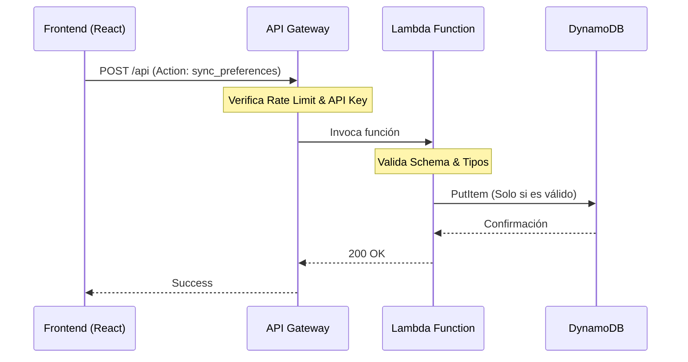

# Fog Music Player

Sistema de reproduccion de musica con arquitectura Fog Computing para procesamiento local de preferencias de usuario.

## Miembros del Equipo
- Christian Pardavé Espinoza
- Saul Condori Machaca

## Arquitectura del Sistema

### Diagrama de Componentes

```
+-------------------+     +------------------+     +-------------------+
|                   |     |                  |     |                   |
|  Frontend (React) |---->|   API Gateway    |---->|  Lambda Function  |
|  + Service Worker |     |   (Throttling)   |     |  (Validacion)     |
|                   |     |                  |     |                   |
+--------+----------+     +------------------+     +---------+---------+
         |                                                   |
         |                                                   v
         |                                         +-------------------+
         |    Credenciales Cognito                 |                   |
         +---------------------------------------->|     DynamoDB      |
         |    (Solo lectura catalogo)              |  (Songs + Users)  |
         |                                         |                   |
         |                                         +-------------------+
         |
         v
+-------------------+
|                   |
|     S3 Bucket     |
|  (Media + Thumbs) |
|                   |
+-------------------+
```

### Componentes Principales

**Frontend (React + Vite)**
- Aplicacion SPA con React 19 y Vite 7
- Interfaz de usuario para reproduccion de musica
- Comunicacion con servicios AWS

**Service Worker (Fog Node)**
- Nodo de procesamiento local que implementa Fog Computing
- Almacenamiento en IndexedDB para persistencia offline
- Analisis de preferencias sin enviar datos al servidor

**API Gateway**
- Punto de entrada unico para operaciones de escritura
- Rate limiting (50 req/s, burst 100)
- Proteccion contra ataques DDoS

**Lambda Function**
- Middleware de validacion y sanitizacion
- Verificacion de esquema de datos
- Control de acciones permitidas

**DynamoDB**
- Tabla `fog-music-songs`: Catalogo de canciones
- Tabla `fog-music-users`: Preferencias de usuarios

**S3 Bucket**
- Almacenamiento de archivos de audio encriptados
- Miniaturas de albums publicas

**Cognito Identity Pool**
- Autenticacion anonima de dispositivos
- Credenciales temporales con permisos minimos

---

## Fog Computing

### Concepto

El paradigma Fog Computing se implementa mediante un Service Worker que actua como nodo de procesamiento intermedio entre el dispositivo del usuario y la nube. Este enfoque reduce la latencia, minimiza el consumo de ancho de banda y mejora la privacidad del usuario.

### Implementacion

El Service Worker (`sw.js`) funciona como un nodo Fog independiente que:

1. **Captura eventos de reproduccion**: Registra cada cancion reproducida, tiempo de escucha y acciones del usuario
2. **Procesa datos localmente**: Calcula estadisticas de generos favoritos, artistas preferidos y tiempo total de escucha
3. **Almacena en IndexedDB**: Persiste las preferencias localmente sin necesidad de conexion
4. **Sincroniza periodicamente**: Cada 3 minutos envia un resumen agregado a la nube

### Flujo de Datos

```
Usuario reproduce cancion
         |
         v
Service Worker captura evento
         |
         v
Actualiza contadores en IndexedDB
         |
         v
Calcula top generos y artistas
         |
         v
[Cada 3 min] Sincroniza con DynamoDB via API Gateway
```

### Beneficios

- **Baja latencia**: Las preferencias se procesan localmente en milisegundos
- **Offline-first**: La aplicacion funciona sin conexion
- **Privacidad**: Los datos granulares permanecen en el dispositivo
- **Eficiencia**: Solo se envian datos agregados a la nube

---

## Servicios del Frontend

### awsService.js

Servicio principal para comunicacion con AWS.

| Funcion | Descripcion | Destino |
|---------|-------------|---------|
| `initializeAWS()` | Obtiene credenciales de Cognito | Cognito |
| `getAllSongs()` | Lee catalogo de canciones | DynamoDB (directo) |
| `getUserFullProfile()` | Obtiene perfil del usuario | API Gateway / DynamoDB |
| `updateUserTastes()` | Actualiza gustos de genero | API Gateway |
| `syncPreferencesToDynamo()` | Sincroniza preferencias FOG | API Gateway |
| `downloadSongFromS3()` | Descarga audio encriptado | S3 |

### swService.js

Servicio de comunicacion con el Service Worker.

| Funcion | Descripcion |
|---------|-------------|
| `registerServiceWorker()` | Registra y activa el SW |
| `trackPlay()` | Registra reproduccion de cancion |
| `trackListeningTime()` | Reporta tiempo de escucha |
| `trackSearch()` | Registra busqueda del usuario |
| `getPreferences()` | Obtiene preferencias locales |
| `requestSync()` | Fuerza sincronizacion con cloud |

### Flujo de Reproduccion

1. Usuario selecciona cancion
2. Frontend llama `trackPlay()` al Service Worker
3. SW actualiza contadores en IndexedDB
4. Frontend descarga audio desde S3 via `downloadSongFromS3()`
5. Audio se desencripta localmente con AES-256
6. Durante reproduccion, `trackListeningTime()` reporta segundos escuchados
7. Periodicamente, SW sincroniza con DynamoDB via API Gateway

---

## Infraestructura con Pulumi

### Recursos Desplegados

La infraestructura se define en `iac/__main__.py` y despliega los siguientes recursos:

| Recurso | Tipo | Proposito |
|---------|------|-----------|
| `fog-music-media` | S3 Bucket | Almacena audios y miniaturas |
| `fog-music-songs` | DynamoDB Table | Catalogo de canciones |
| `fog-music-users` | DynamoDB Table | Preferencias de usuarios |
| `fog-music-api` | Lambda Function | Validacion de datos |
| `fog-music-api` | API Gateway | Punto de entrada seguro |
| `fog_music_identity_pool` | Cognito Identity Pool | Autenticacion anonima |

### Principio de Minimo Privilegio

La arquitectura implementa seguridad en capas:

**Rol de Usuario No Autenticado (Cognito)**
- Lectura de S3 (audios y miniaturas)
- Lectura de DynamoDB (solo tabla de canciones)
- Sin acceso directo a tabla de usuarios

**Rol de Lambda**
- Lectura/escritura en tabla de usuarios
- Lectura de tabla de canciones
- Escritura en CloudWatch Logs

### API Gateway Security

- Throttling: 50 requests/segundo, burst de 100
- CORS configurado para origenes permitidos
- Validacion de metodos HTTP (POST, OPTIONS)
- Stage de produccion con logging habilitado

### Comandos de Despliegue

```bash
cd iac
pulumi up        # Desplegar infraestructura
pulumi preview   # Ver cambios pendientes
pulumi destroy   # Eliminar recursos
```

---

## Seguridad y Arquitectura Cloud

### Capas de Seguridad

El sistema implementa una estrategia de defensa en profundidad utilizando servicios nativos de AWS:

1.  **API Gateway (Borde)**
    *   **Throttling**: Limitado a 50 peticiones/segundo para prevenir ataques DDoS y abuso.
    *   **Validación**: Rechaza peticiones malformadas antes de que lleguen a la lógica de negocio.
    *   **Logging**: Registro detallado de accesos en CloudWatch para auditoría.

2.  **Lambda (Lógica)**
    *   **Validación de Esquema**: Verifica estrictamente la estructura JSON de entrada.
    *   **Sanitización**: Limpia los datos de entrada para prevenir inyecciones.
    *   **Control de Acciones**: Solo permite un conjunto predefinido de operaciones (`get_profile`, `update_tastes`, `sync_preferences`).

3.  **IAM & Cognito (Identidad)**
    *   **Principio de Mínimo Privilegio**:
        *   El frontend (usuario anónimo) **NO** tiene permisos de escritura en DynamoDB.
        *   Solo la función Lambda tiene permisos de escritura (`PutItem`, `UpdateItem`).
    *   **Credenciales Temporales**: Los tokens de acceso rotan automáticamente cada hora.

### Flujo de Datos Seguro



---

## Despliegue con AWS Amplify

### Configuracion

El frontend se despliega automaticamente con AWS Amplify conectado al repositorio de GitHub.

### Variables de Entorno en Amplify

| Variable | Descripcion |
|----------|-------------|
| `VITE_AWS_REGION` | Region de AWS (us-east-1) |
| `VITE_COGNITO_IDENTITY_POOL_ID` | ID del Identity Pool |
| `VITE_S3_MEDIA_BUCKET` | Nombre del bucket S3 |
| `VITE_DYNAMODB_SONGS_TABLE` | Nombre tabla de canciones |
| `VITE_API_GATEWAY_URL` | URL del API Gateway |
| `VITE_ENCRYPTION_KEY` | Clave de desencriptacion AES |

### CI/CD Pipeline

```
Push a main
     |
     v
Amplify detecta cambio
     |
     v
Ejecuta npm install && npm run build
     |
     v
Despliega a CDN global
     |
     v
Invalida cache de CloudFront
```

### Comandos de Build

```yaml
version: 1
frontend:
  phases:
    preBuild:
      commands:
        - cd music-player-app
        - npm ci
    build:
      commands:
        - npm run build
  artifacts:
    baseDirectory: music-player-app/dist
    files:
      - '**/*'
  cache:
    paths:
      - music-player-app/node_modules/**/*
```

---

## Cognito Identity Pool

### Funcionamiento

Cognito proporciona credenciales temporales de AWS para usuarios anonimos, eliminando la necesidad de almacenar claves de acceso en el frontend.

### Flujo de Autenticacion

1. Frontend solicita identidad anonima a Cognito
2. Cognito genera un Identity ID unico para el dispositivo
3. Cognito asume el rol IAM de usuario no autenticado
4. Frontend recibe credenciales temporales (15 min - 1 hora)
5. Credenciales se usan para acceder a S3 y DynamoDB

### Permisos del Rol No Autenticado

```json
{
  "Statement": [
    {
      "Effect": "Allow",
      "Action": ["s3:GetObject"],
      "Resource": ["arn:aws:s3:::fog-music-media/songs/*"]
    },
    {
      "Effect": "Allow",
      "Action": ["dynamodb:Scan", "dynamodb:GetItem"],
      "Resource": "arn:aws:dynamodb:*:*:table/fog-music-songs"
    }
  ]
}
```

---

## Estructura del Proyecto

```
fog-music-player/
├── iac/                    # Infraestructura como codigo
│   ├── __main__.py         # Definicion Pulumi
│   ├── lambda/
│   │   └── handler.py      # Codigo de la Lambda
│   └── Pulumi.yaml
├── music-player-app/       # Aplicacion frontend
│   ├── public/
│   │   └── sw.js           # Service Worker (Fog Node)
│   ├── src/
│   │   ├── components/     # Componentes React
│   │   ├── pages/          # Paginas de la app
│   │   ├── services/       # Servicios AWS y SW
│   │   ├── hooks/          # Custom hooks
│   │   └── config/         # Configuracion
│   └── package.json
├── audios/                 # Archivos de audio fuente
├── miniaturas/             # Imagenes de albums
└── seed.py                 # Script de poblacion de datos
```

---

## Requisitos

- Node.js 18+
- Python 3.11+
- Pulumi CLI
- AWS CLI configurado
- Cuenta de AWS con permisos de administrador

## Instalacion Local

```bash
# Clonar repositorio
git clone https://github.com/ChristianPE1/fog-music-player.git
cd fog-music-player

# Instalar dependencias del frontend
cd music-player-app
npm install

# Ejecutar en desarrollo
npm run dev
```

## Despliegue de Infraestructura

```bash
# Configurar Pulumi
cd iac
pulumi login
pulumi stack init dev

# Desplegar
pulumi up

# Obtener outputs
pulumi stack output api_gateway_url
```
